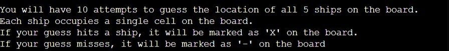
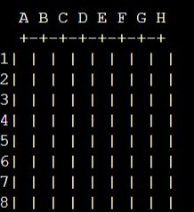
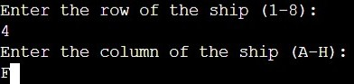
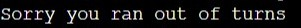
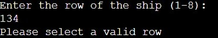
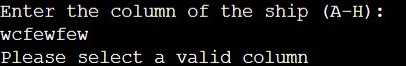
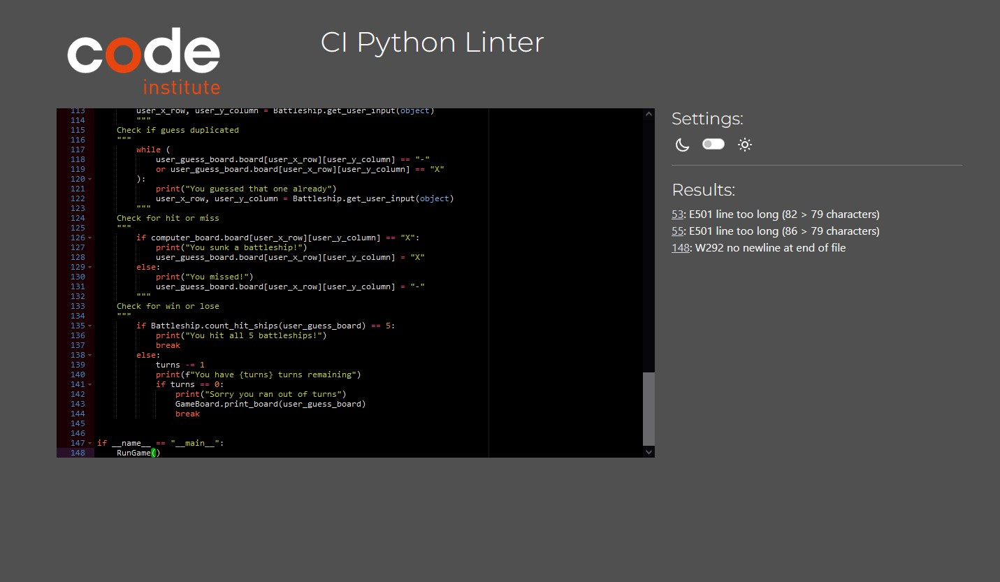

# Battleships Game

### [Game Live](https://battleships-6d00f58f1c3d.herokuapp.com/)

## Content

* [Description](#description)
* [Project goals and UX](#project-goals-and-ux)
    * [User Goals](#user-goals)
    * [Site owners Goals](#site-owners-goals)
    * [Target Audience](#target-audience)
    * [User Requirements](#user-requirements)
    * [User Stories](#user-stories)
* [Features](#features)
* [Flowchart](#flowchart)
* [Testing](#testing)
    * [Validator Testing](#validator-testing)
    * [Tested features](#tested-features)
    * [Test Cases](#test-cases)
    * [User Stories](#user-stories)
* [Fixed Bugs](#fixed-bugs)
* [Deployment](#deployment)
    * [Cloning & Forking](#cloning--forking)
    * [Local Deployment](#local-deployment)
    * [Remote Deployment](#remote-deployment)
* [Credits](#credits)
 
# **Description**

### This is a Python implementation of the classic Battleship game. The game is played on a grid where players attempt to sink each other's ships by guessing their coordinates.
 

# **Project Goals and UX**

## User Goals

### The main goal of Battleships Gmae is to provide users with an enjoyable gaming experience including:
- Interesting gameplay that challenges the mind.
- Clear instructions and user interface.

## Site Owner Goals

### As an owner of the project my requirements are:
- Create a logical functional game.
- Provide a well user experience.

## Target Audience

### Battleships targets a diverse audience, including:
- Game enthusiasts at any age.
- Casual gamers looking for a fun pastime.
- Individuals looking a challenge.

## User Requirements

### The users of Battleships Game expect:
- Enjoyable gaming experience.
- Intuitive game controls.
- Responsive feedback during gameplay.

## User Stories
1. As a player, I want to understand the rules of the game.
2. As a player, I want the game to provide a funny experience.

# **Features**
### Welcome and Instruction Message

 Displays a welcome message to the user upon login.  

### Game Board

 Generated board to play the game.   

### Game Inputs
Allows the user to put their guesses and provides feedback on the result.  

### Result 
Displaying a result after putting the guess.  

### Out of turns
This message will appear when you out of turns. 

### Invalid input
This message will appear if input is incorrect. 
 

# **Testing**

## Validator Testing

For code testing I used CI Python Linter The results are below. 

## Tested features

- Game Board
- Valid input
- Invalid input

## Test Cases

### Game board
| Test Case | Description | Expected Result | Actual Result |
|-----------|-------------|-----------------|---------------|
| Game Board | Check game board layout | Game board matches expected layout | Passed |

### Input Handling
| Test Case | Description | Expected Result | Actual Result |
|-----------|-------------|-----------------|---------------|
| Valid Input | Enter valid coordinates | Coordinate is accepted and processed | Passed |
| Invalid Input | Enter invalid coordinates | Error message displayed  | Passed |

## User Stories Testing

|Story No.|Result|Story|
| ------------- | ------------- | ------------- |
|1|As a player,   I want to understand the rules of the game.   I know I am done because instruction opens up above the game board.  |Test Pass|
|2|As a player,    want the game to provide a funny experience.   I know I am done when code functionality works with no issues.  |Test Pass |

# **Deployment**

### Cloning & Forking
#### Fork
1. On GitHub.com, navigate to the [nil1143/battleship_game](https://github.com/nil1143/battleship_game) repository.
2. In the top-right corner of the page, click Fork.
3. By default, forks are named the same as their parent repositories. You can change the name of the fork to distinguish it further.
4. Add a description to your fork.
5. Click Create fork.

#### Clone
1. Above the list of files click the button that says 'Code'.
2. Copy the URL for the repository.
3. Open Terminal. Change the directory to the location where you want the cloned directory.
4. Type git clone, and then paste the URL
5. Press Enter.

### Local Deployment
1. Sign up to [Gitpod](https://gitpod.io/)
2. Download the Gitpod browser extension.
3. On GitHub.com, navigate to the [nil1143/battleship_game](https://github.com/nil1143/battleship_game) repository.
4. Above the list of files click the button that says 'Gitpod'.
5. Once open you will need to install the libraries, you can do this by typing "pip3 install -r requirements.txt" into the terminal

### Remote Deployment 
 The prgoram was deployed to Heroku. If you have forked/cloned the repository the steps to deploy are:
 1. On Heroku, create a new app.
 2. input a name for your app
 3. Click on the settings tab
 4. Scroll to the Config Vars and click on the "Reveal Config Vars"
 5. Input CREDS into the key field and the content of the Google API creds file into the value area.
 6. Add another config, PORT into key and 8000 into value.
 7. Set the buildbacks to Python and NodeJs in that order .
 8. Link your Heroku app to you repository.
 9. Click on Deploy.
 10. The page will then provide the url to the python terminal.

 The live link can be found here - [Battleships Game](https://battleships-6d00f58f1c3d.herokuapp.com/)

 # **Credits**
 - [Python.org](https://www.python.org/) for the documentation
 - CI Python Linter to validate the code [CI Linter](https://pep8ci.herokuapp.com/)
 - Code Institute Python lessons.
 - Code Institute Love Sandwiches project.
 - VSCode: Mainly used as the primary text editor for writing the game code.
 - Git and GitHub: Used Git for version control, allowing for collaboration and tracking of code changes on GitHub.
 - Heroku: Deployed the game on Heroku's server, making it accessible to anyone with an internet connection.
