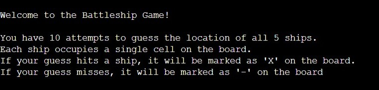

# Battleships Game

### [Game Live](https://battleships-6d00f58f1c3d.herokuapp.com/)

## Content

* [Description](#description)
* [Project goals and UX](#project-goals-and-ux)
    * [User Goals](#user-goals)
    * [Site owners Goals](#site-owners-goals)
    * [Target Audience](#target-audience)
    * [User Requirements](#user-requirements)
    * [User Stories](#user-stories)
* [Features](#features)
* [Testing](#testing)
    * [Validator Testing](#validator-testing)
    * [Tested features](#tested-features)
    * [Test Cases](#test-cases)
    * [User Stories](#user-stories)
* [Fixed Bugs](#fixed-bugs)
* [Deployment](#deployment)
    * [Cloning & Forking](#cloning--forking)
    * [Local Deployment](#local-deployment)
    * [Remote Deployment](#remote-deployment)
* [Credits](#credits)
 
# **Description**

### This is a Python implementation of the classic Battleship game. The game is played on a grid where players attempt to sink each other's ships by guessing their coordinates.
 

# **Project Goals and UX**

## User Goals

### The main goal of Battleships Gmae is to provide users with an enjoyable gaming experience including:
- Interesting gameplay that challenges the mind.
- Clear instructions and user interface.

## Site Owner Goals

### As an owner of the project my requirements are:
- Create a logical functional game.
- Provide a well user experience.

## Target Audience

### Battleships targets a diverse audience, including:
- Game enthusiasts at any age.
- Casual gamers looking for a fun pastime.
- Individuals looking a challenge.

## User Requirements

### The users of Battleships Game expect:
- Enjoyable gaming experience.
- Intuitive game controls.
- Responsive feedback during gameplay.

## User Stories
1. As a player, I want to understand the rules of the game.
2. As a player, I want the game to provide a funny experience.

# **Features**
### Welcome and Instruction Message

 Displays a welcome message to the user upon login.  

### Game Board

 Generated board to play the game.   

### Game Inputs
Allows the user to put their guesses and provides feedback on the result.  

### Result 
Displaying a result after putting the guess.  

### Out of turns
This message will appear when you out of turns. 

### Invalid input
This message will appear if input is incorrect. 
 

# **Testing**

## Validator Testing

For code testing I used CI Python Linter The results are below. 

## Tested features

- Game Board
- Valid input
- Invalid input

## Test Cases

### Game board
| Test Case | Description | Expected Result | Actual Result |
|-----------|-------------|-----------------|---------------|
| Game Board | Check game board layout | Game board matches expected layout | Passed |

### Input Handling
| Test Case | Description | Expected Result | Actual Result |
|-----------|-------------|-----------------|---------------|
| Valid Input | Enter valid coordinates | Coordinate is accepted and processed | Passed |
| Invalid Input | Enter invalid coordinates | Error message displayed | Passed |

## User Stories Testing

|Story No.|Result|Story|
| ------------- | ------------- | ------------- |
|1|As a player,   I want to understand the rules of the game.   I know I am done because instruction opens up above the game board.  |Test Pass|
|2|As a player,    want the game to provide a funny experience.   I know I am done when code functionality works with no issues.  |Test Pass |

# **Fixed bugs**

During code testing I met unexpected bug/error with the inputs in **get_user_input(self)** function.  If I left input empty it caused error in the console like in the screenshoot below: 

Before fixing the issue **get_user_input(self)** function was like this: 

The solution to fix the issue was method to check if user input length is 0.  If so, trigger the error message. 
